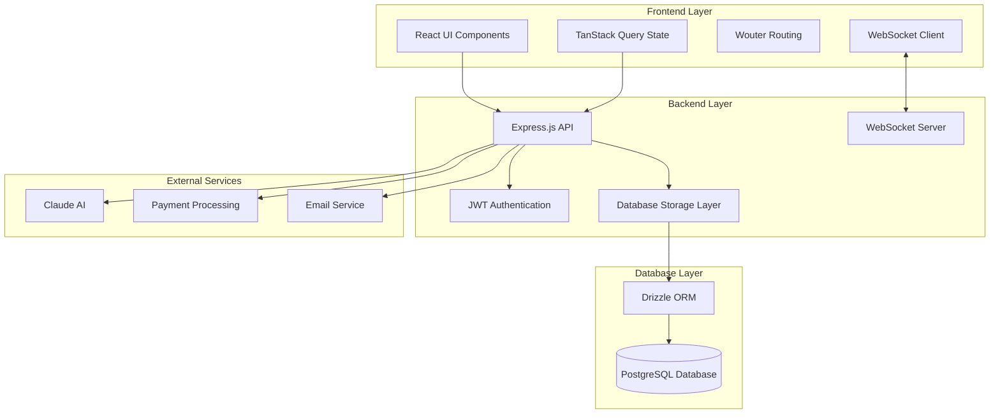
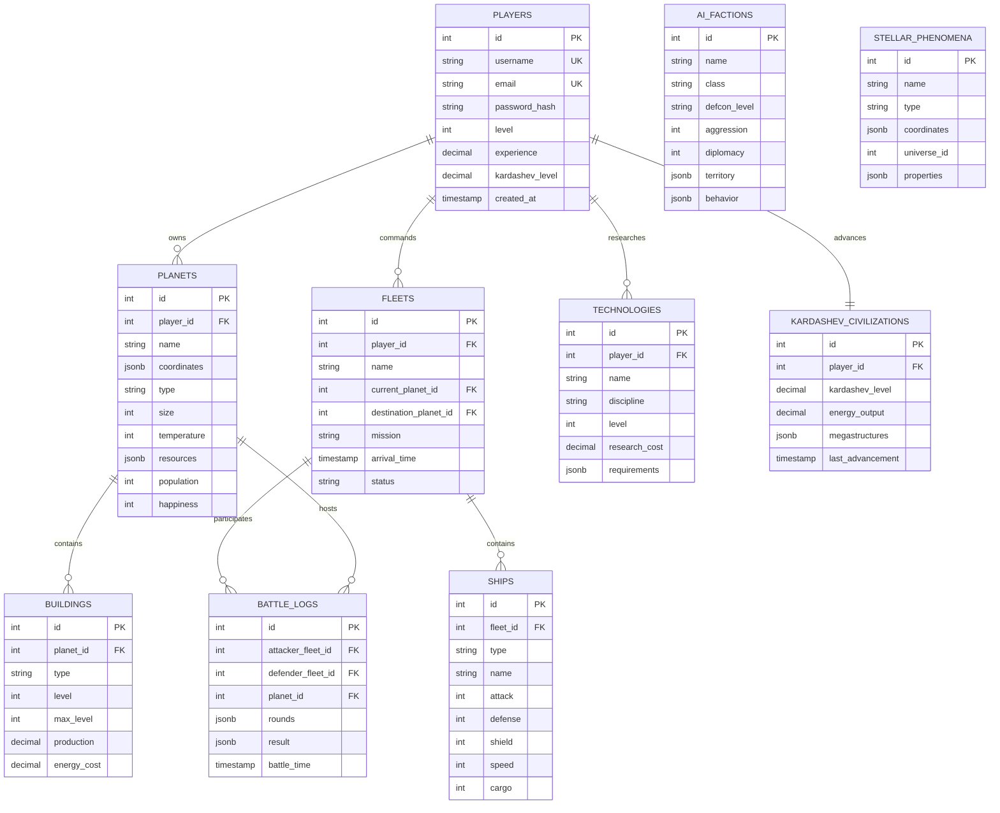
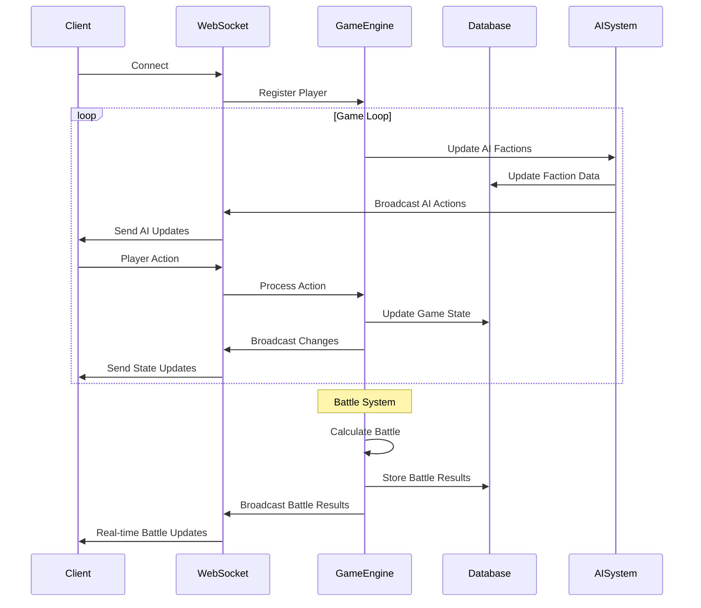
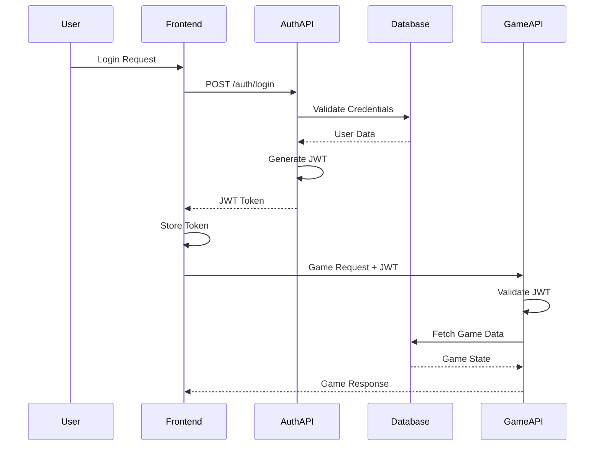
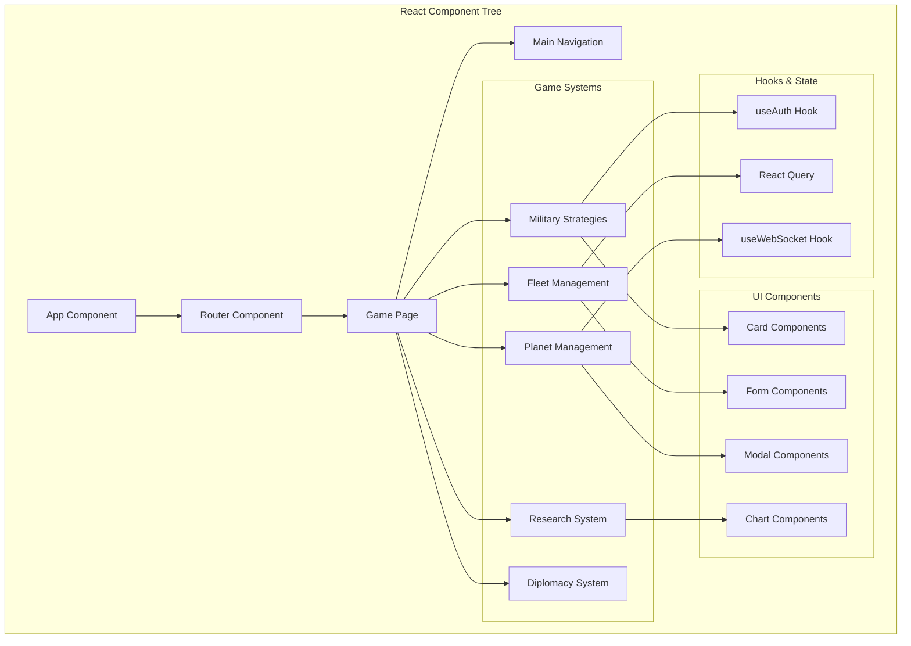
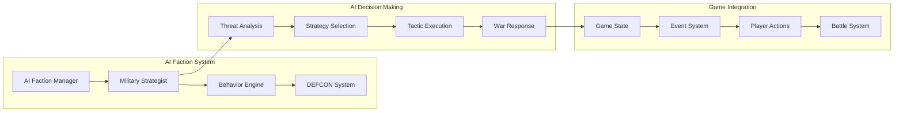
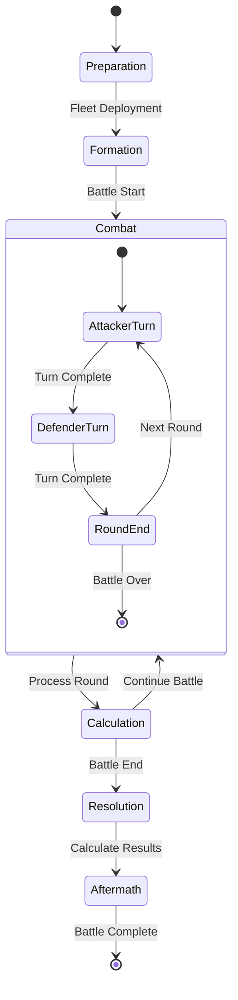
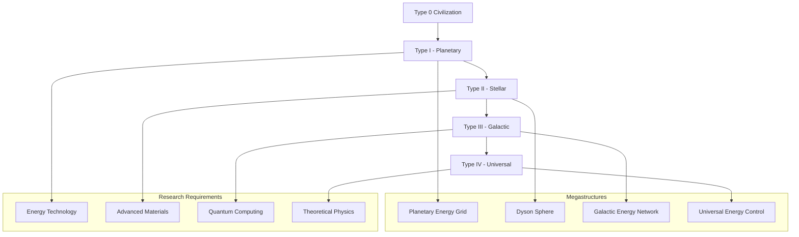
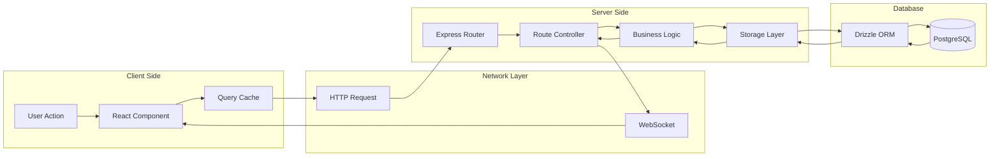
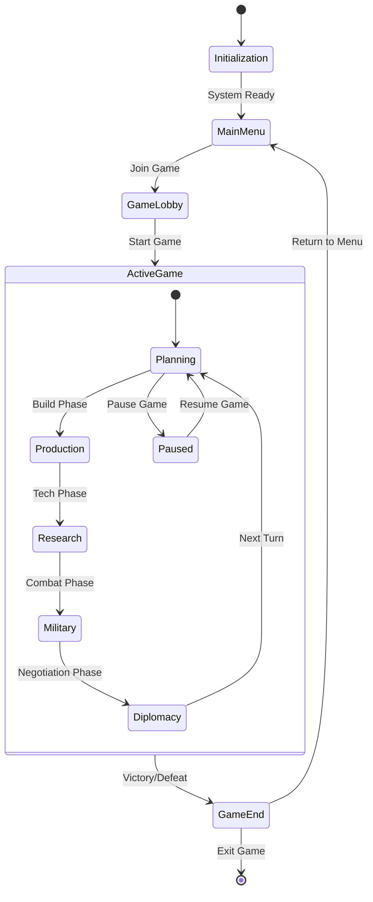

# UML Diagrams - Space Strategy Game

## System Architecture Overview



## Core Game Systems Class Diagram

```mermaid
classDiagram
    class Player {
        +id: number
        +username: string
        +email: string
        +level: number
        +experience: number
        +kardashevLevel: number
        +reputation: number
        +createdAt: Date
        +getFleets(): Fleet[]
        +getPlanets(): Planet[]
        +getResources(): Resources
    }
    
    class Planet {
        +id: number
        +name: string
        +coordinates: Coordinates
        +type: string
        +size: number
        +temperature: number
        +resources: Resources
        +buildings: Building[]
        +population: number
        +happiness: number
        +upgrade(): void
        +colonize(): void
    }
    
    class Fleet {
        +id: number
        +name: string
        +ships: Ship[]
        +currentPlanet: Planet
        +destination: Planet
        +mission: MissionType
        +arrivalTime: Date
        +status: FleetStatus
        +move(destination: Planet): void
        +attack(target: Fleet): BattleResult
    }
    
    class Ship {
        +id: number
        +type: ShipType
        +name: string
        +attack: number
        +defense: number
        +shield: number
        +speed: number
        +cargo: number
        +fuel: number
        +upgrade(): void
        +repair(): void
    }
    
    class Building {
        +id: number
        +type: BuildingType
        +level: number
        +maxLevel: number
        +production: number
        +energyCost: number
        +upgrade(): void
        +demolish(): void
    }
    
    class Technology {
        +id: number
        +name: string
        +discipline: ScienceDiscipline
        +level: number
        +researchCost: number
        +requirements: Technology[]
        +research(): void
        +isAvailable(): boolean
    }
    
    class AIFaction {
        +id: number
        +name: string
        +class: FactionClass
        +defconLevel: DefconLevel
        +aggression: number
        +diplomacy: number
        +territory: string[]
        +behavior: BehaviorPattern
        +updateDefcon(): void
        +executeStrategy(): void
    }
    
    class Battle {
        +id: number
        +attacker: Fleet
        +defender: Fleet
        +location: Planet
        +rounds: BattleRound[]
        +result: BattleResult
        +startTime: Date
        +endTime: Date
        +simulate(): BattleResult
    }
    
    Player ||--o{ Planet : owns
    Player ||--o{ Fleet : commands
    Player ||--o{ Technology : researches
    Planet ||--o{ Building : contains
    Fleet ||--o{ Ship : contains
    Fleet ||--|| Battle : participates
    AIFaction ||--o{ Fleet : controls
    
    class Resources {
        +metal: number
        +crystal: number
        +deuterium: number
        +energy: number
        +food: number
        +population: number
    }
    
    class Coordinates {
        +galaxy: number
        +system: number
        +position: number
        +x: number
        +y: number
        +z: number
    }
```

## AI Military Strategies System

```mermaid
classDiagram
    class AIMilitaryStrategist {
        -factionId: number
        -currentStrategy: MilitaryStrategy
        +analyzeThreats(): ThreatAnalysis
        +selectStrategy(context): MilitaryStrategy
        +executeTactic(tactic): TacticResult
    }
    
    class MilitaryStrategy {
        +id: string
        +name: string
        +type: StrategyType
        +requirements: Requirements
        +tactics: MilitaryTactic[]
        +effectiveness: Effectiveness
        +riskLevel: number
        +duration: number
    }
    
    class MilitaryTactic {
        +id: string
        +name: string
        +category: TacticCategory
        +action: string
        +parameters: object
        +successRate: number
        +cost: Resources
    }
    
    class AIWarResponseSystem {
        +handleWarDeclaration(faction, target): WarResponse
        +generateWarResponse(strategy, faction): Response
        +getImmediateActions(strategy): string[]
    }
    
    AIMilitaryStrategist ||--|| MilitaryStrategy : uses
    MilitaryStrategy ||--o{ MilitaryTactic : contains
    AIMilitaryStrategist --> AIWarResponseSystem : coordinates
```

## Database Entity Relationship Diagram



## WebSocket Communication Flow



## Authentication and Authorization Flow



## Component Architecture Diagram



## AI System Architecture



## Battle System State Machine



## Kardashev Civilization Advancement



## Data Flow Architecture



## Game State Management

